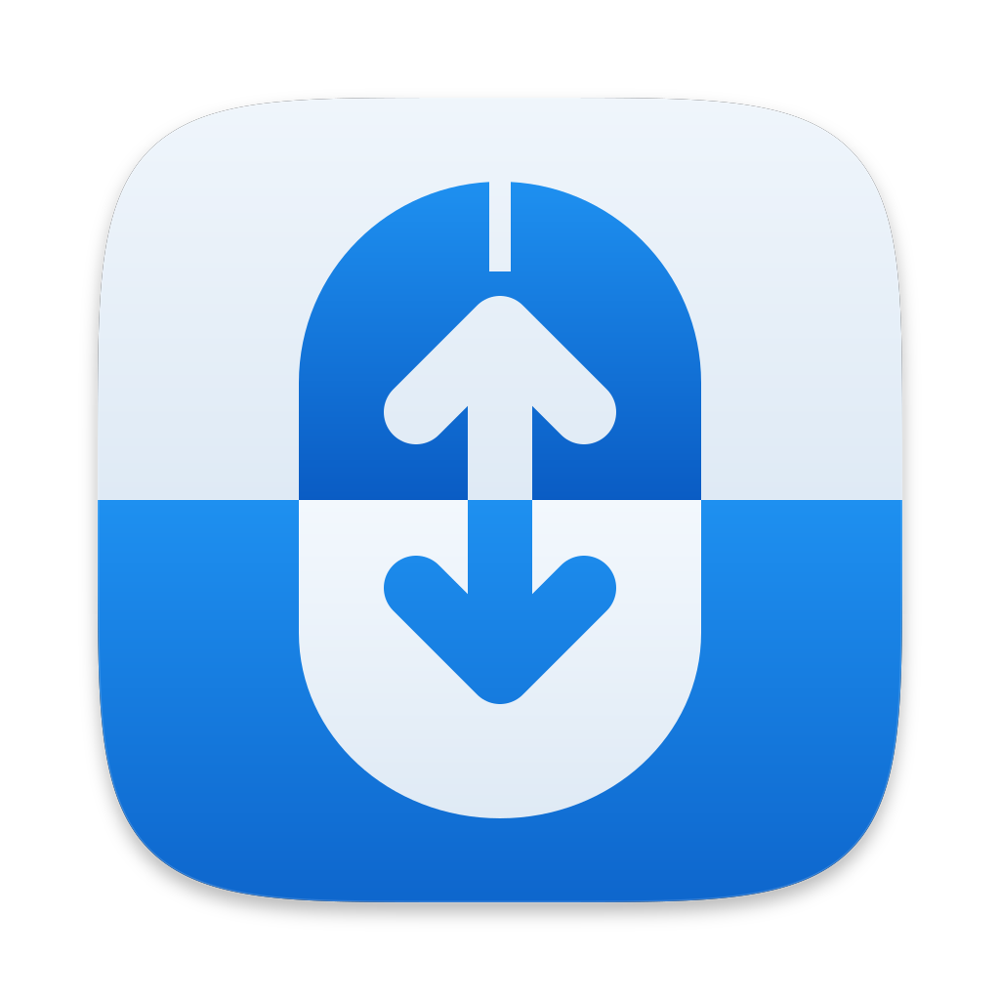

<p align="center">
  
</p>

<h1 align="center">ScrollToggle</h1>

<p align="center">마우스를 연결하면 자연스러운 스크롤을 끄고, 연결을 해제하면 다시 켜는 macOS 메뉴 막대 앱입니다.</p>

macOS에서는 트랙패드와 마우스가 자연스러운 스크롤 설정을 함께 사용합니다. 트랙패드에서는 켜고 마우스에서는 끄고 싶다면, 마우스를 연결하거나 해제할 때마다 설정을 바꿔야 합니다. ScrollToggle은 마우스 연결 상태에 따라 이 설정을 자동으로 바꿉니다. 장치나 설정이 바뀔 때만 동작해 대기 중에는 CPU를 거의 사용하지 않습니다.

## 기능

- **자동 전환**: USB나 Bluetooth 마우스를 연결하면 자연스러운 스크롤을 끄고, 연결된 마우스가 없으면 다시 켭니다. 앱을 실행할 때도 연결 상태에 맞춰 설정합니다.
- **수동 전환**: 메뉴에서 직접 켜거나 끌 수 있습니다. 수동으로 바꾼 설정은 다음 장치 연결·해제 전까지 유지됩니다.
- **상태 표시**: 자연스러운 스크롤이 켜져 있으면 `↕`, 꺼져 있으면 흐린 `⇅` 아이콘을 표시합니다. 설정이 바뀌면 아이콘 아래에 2초 동안 말풍선으로 현재 상태를 보여 줍니다. 시스템 설정에서 바꾼 경우에도 반영됩니다.
- **즉시 반영**: 스크롤 방향은 로그아웃 없이 바로 바뀝니다.
- **로그인 시 실행**: 메뉴에서 켜면 로그인할 때 자동으로 실행됩니다.
- **리소스 사용량**: 폴링 없이 macOS의 알림을 받아 동작합니다. 측정 시 대기 중 CPU 사용량은 0.0%, 실행 직후 메모리는 약 11MB였습니다. 자세한 내용은 [동작 원리](#동작-원리)를 참고하세요.

Dock과 앱 전환기에는 표시되지 않으며, 입력 모니터링 같은 별도 권한도 필요하지 않습니다.

## 요구 사항

- macOS 13 Ventura 이상 (Apple Silicon, Intel 모두 지원)
- Xcode 또는 Xcode Command Line Tools

Command Line Tools가 없다면 먼저 설치하세요.

```sh
xcode-select --install
```

## 설치

미리 빌드된 앱은 따로 배포하지 않으므로 소스를 받아 직접 빌드해야 합니다.

```sh
git clone https://github.com/bell-person-ii/ScrollToggle.git
cd ScrollToggle
./build.sh
```

`build/ScrollToggle.app`이 만들어집니다. `/Applications`로 옮긴 뒤 실행하면 메뉴 막대에 아이콘이 나타납니다.

```sh
cp -R build/ScrollToggle.app /Applications/
open /Applications/ScrollToggle.app
```

앱에는 ad-hoc 서명이 적용됩니다. 빌드한 Mac에서는 바로 실행할 수 있지만, 다른 Mac에 복사하면 Gatekeeper가 실행을 막을 수 있으므로 사용할 Mac에서 직접 빌드하세요.

### 업데이트

앱을 종료한 뒤 최신 소스를 받아 다시 빌드하고 덮어씁니다.

```sh
git pull
./build.sh
rm -rf /Applications/ScrollToggle.app
cp -R build/ScrollToggle.app /Applications/
```

## 사용법

메뉴 막대 아이콘을 클릭하면 아래 메뉴가 열립니다. 스크롤 방향은 메뉴에서 ‘자연스러운 스크롤 끄기 / 켜기’를 선택하면 바뀝니다.

| 항목 | 설명 |
| --- | --- |
| 자연스러운 스크롤: 켬 / 끔 | 현재 상태 (선택할 수 없음) |
| 자연스러운 스크롤 끄기 / 켜기 | 방향을 바로 전환 |
| 로그인 시 실행 | 로그인 항목 등록/해제 |
| 종료 (⌘Q) | 앱 종료 |

## 동작 원리

ScrollToggle은 macOS가 보내는 장치 연결·해제 알림과 스크롤 설정 변경 알림을 받아 동작합니다. 변화를 확인하기 위해 주기적으로 실행하는 작업은 없습니다.

### 마우스 연결 감지

일정한 간격으로 장치 목록을 확인하는 방식을 폴링(polling)이라고 합니다. 연결 상태가 그대로여도 계속 확인해야 하고, 장치가 바뀌면 다음 확인 시점까지 기다려야 합니다. ScrollToggle은 연결·해제 알림을 받아 처리하므로 주기적인 확인이 필요하지 않습니다.

예를 들어 2초 간격으로 하루 종일 폴링하면 장치 목록을 43,200번 확인하게 되며, 타이머 때문에 CPU가 절전 상태에서 깨어날 때는 전력도 추가로 소모됩니다.

| | 폴링 방식 | ScrollToggle |
| --- | --- | --- |
| 처리 시점 | 정해진 간격마다 확인 | 연결·해제 알림을 받으면 처리 |
| 반응 속도 | 다음 확인 시점까지 대기 | 알림을 받으면 즉시 반영 |
| 대기 중 작업 | 장치 목록을 주기적으로 확인 | 알림 대기 |

### 설정 변경 과정

1. **연결·해제 감지** ([src/MouseWatcher.swift](src/MouseWatcher.swift)): IOKit HID 매니저에 콜백을 등록해 메인 스레드의 런 루프에서 장치 변경 알림을 받습니다. 처리할 이벤트가 없으면 스레드는 커널에서 대기하므로, 알림을 기다리는 동안에는 CPU를 사용하지 않습니다.
2. **외장 마우스 확인**: 트랙패드도 HID 마우스로 인식되므로 내장 장치, 이름에 "trackpad"가 들어간 장치, USB/Bluetooth가 아닌 가상 장치는 제외합니다. 연결·해제 직후에는 장치 목록 갱신이 끝나지 않았을 수 있어, 바로 처리한 뒤 0.5초 후에 한 번 더 확인합니다.
3. **스크롤 방향 변경** ([src/ScrollDirection.swift](src/ScrollDirection.swift)): 시스템 설정의 "자연스러운 스크롤" 항목에서 사용하는 비공개 프레임워크 `PreferencePanesSupport`의 함수(`swipeScrollDirection` / `setSwipeScrollDirection`)를 `dlopen`으로 불러 설정을 바꿉니다. 이미 원하는 값이면 변경하지 않습니다.
4. **다음 알림 대기**: 처리가 끝나면 런 루프로 돌아갑니다.

시스템 설정이나 다른 앱에서 스크롤 방향을 바꾸면 분산 알림(`SwipeScrollDirectionDidChangeNotification`)을 받아 아이콘을 갱신합니다 ([src/main.swift](src/main.swift)). 이때도 설정을 주기적으로 확인하지 않습니다.

비공개 API를 사용하기 때문에 이후 macOS 업데이트에서 동작하지 않을 수 있습니다. 함수를 찾지 못하면 실행할 때 경고를 띄우고, 이후에는 현재 상태만 표시합니다.

### 스크롤 입력 처리

ScrollToggle은 시스템의 스크롤 설정만 바꾸며, 실제 마우스와 트랙패드 입력은 macOS가 처리합니다. 장치를 열거나 스크롤 이벤트를 가로채지 않고 연결된 장치 목록만 확인하므로, 손쉬운 사용이나 입력 모니터링 권한이 필요하지 않습니다.

마우스와 트랙패드의 방향을 각각 설정하는 방식은 아니므로, 마우스가 연결된 동안에는 트랙패드에서도 자연스러운 스크롤이 꺼집니다.

### 앱 구성

- **UI**: 메뉴 항목은 메뉴를 열 때 생성하고, 상태 말풍선은 설정이 바뀔 때 표시한 뒤 2초 후에 닫습니다. 메뉴 막대 아이콘은 macOS에 내장된 SF Symbols를 사용합니다.
- **메뉴 막대 앱**: `LSUIElement`로 실행하며, 별도 메인 창이나 Dock 아이콘은 없습니다.
- **백그라운드 작업**: 앱에서 별도 스레드나 반복 타이머를 만들지 않으며, 네트워크에도 접속하지 않습니다.
- **의존성과 크기**: macOS 기본 프레임워크(Cocoa, IOKit, ServiceManagement)를 사용하며 외부 라이브러리는 없습니다. Swift 파일 세 개를 실행 파일 하나로 컴파일합니다. 실행 파일은 약 110KB, 아이콘을 포함한 앱 전체는 약 600KB입니다.

### 리소스 사용량

Apple Silicon Mac, macOS 26에서 측정한 값입니다. 메모리는 활동 모니터의 "메모리" 열과 같은 기준(`footprint`)입니다.

| 항목 | 값 |
| --- | --- |
| 메모리 (실행 직후) | 약 11MB |
| 메모리 (메뉴와 말풍선을 사용한 뒤) | 약 19MB |
| 참고: 아이콘만 띄우는 빈 메뉴 막대 앱 | 약 10MB |
| 대기 중 CPU | 0.0% |
| 51분 동안 쓴 CPU 시간 합계 | 약 1.2초 |

실행 직후에는 빈 메뉴 막대 앱보다 약 1MB를 더 사용했습니다. 장치 감시(IOKit)와 비공개 프레임워크를 추가했을 때는 뚜렷한 메모리 증가가 없었습니다. 메뉴와 말풍선을 사용한 뒤에는 AppKit의 UI 처리로 메모리 사용량이 늘어났으며, 앱에서 별도로 데이터를 쌓아 두지는 않습니다.

## 프로젝트 구조

```
ScrollToggle/
├── build.sh                  # 앱 번들 빌드 및 ad-hoc 서명
├── src/
│   ├── main.swift            # 앱 진입점, 메뉴 막대 UI, 로그인 항목
│   ├── MouseWatcher.swift    # 외장 마우스 연결 감지
│   └── ScrollDirection.swift # 자연스러운 스크롤 읽기/쓰기
└── icon/
    ├── AppIcon.svg           # 64px 이상용 원본 아이콘
    ├── AppIcon-32px.svg      # 32px용
    ├── AppIcon-16px.svg      # 16px용
    ├── AppIcon.icns          # 빌드에 들어가는 아이콘
    ├── make_icon.swift       # SVG → AppIcon.icns 변환
    └── classic/              # 이전 아이콘 (참고용)
```

## 아이콘 다시 만들기

SVG를 수정했다면 프로젝트 루트에서 다음을 실행해 `icon/AppIcon.icns`를 다시 만든 뒤 빌드하세요.

```sh
swift icon/make_icon.swift
./build.sh
```

## 라이선스

[PolyForm Strict License 1.0.0](LICENSE)을 따릅니다. 소스 코드는 공개되어 있지만 오픈 소스는 아닙니다. 개인적, 비상업적 목적으로 빌드해서 사용하는 것은 허용되지만, 수정하거나 재배포하는 것은 허용되지 않습니다.
